# Двухсервисная система LLM-консультаций

## Описание проекта

Распределённая система, состоящая из двух независимых сервисов:
- **Auth Service** (FastAPI) — регистрация, аутентификация, выпуск JWT.
- **Bot Service** (aiogram + Celery + RabbitMQ + Redis) — Telegram-бот, который валидирует JWT и предоставляет доступ к LLM через OpenRouter.

## Архитектура
Система состоит из двух независимых сервисов, которые взаимодействуют через JWT-токены и очередь сообщений.

Auth Service - cервис аутентификации на FastAPI. Отвечает за регистрацию, логин и выпуск JWT. 
Хранит пользователей в SQLite.

Auth Service не знает о Telegram, очередях или LLM.

Bot Service - Telegram бот на aiogram. Принимает  и валидирует JWT, даёт доступ к LLM.

Компоненты:

Telegram-бот — команда /token <JWT> сохраняет токен в Redis, текстовые сообщения отправляют задачу в очередь

Redis — хранит JWT, привязанные к Telegram user_id

RabbitMQ — брокер сообщений (очередь задач)

Celery worker — забирает задачи из очереди, вызывает OpenRouter

OpenRouter client — HTTP-клиент для запросов к LLM

Bot Service не имеет своей базы пользователей и не создаёт JWT — только проверяет.

## Сценарий работы

1. Пользователь регистрируется в Auth Service через Swagger.
2. Пользователь логинится, получая JWT-токен.
3. Пользователь передаёт токен Telegram-боту вводя команду `/token <JWT>`.
4. Бот сохраняет токен в Redis.
5. Пользователь отправляет текстовое сообщение боту.
6. Боту проверяет токен и отправляет задачу в Celery.
7. Celery worker через OpenRouter получает ответ от LLM и возвращает пользователю.

## Технологии

- **Python 3.11**
- **FastAPI** — Auth Service
- **aiogram 3.x** — Telegram Bot
- **Celery + RabbitMQ** — асинхронная обработка
- **Redis** — хранение JWT и результат бэкенд
- **OpenRouter API** — LLM (модель `openai/gpt-3.5-turbo`)
- **Docker / Docker Compose** — контейнеризация
- **Pytest** — тестирование
- **uv** — управление зависимостями

## Установка и запуск

### Установить Docker (Docker Desktop) (если не установлен)

### Клонировать репозиторий
```bash
git clone https://github.com/NikolaiShilenko/llm-consulting-system.git
cd llm-consulting-system
```

### Настроить переменные окружения
#### Создать .env, скопировать .env.example в .env и добавить:
    TELEGRAM_BOT_TOKEN=ваш_токен
    OPENROUTER_API_KEY=ваш_ключ

### Запустить Docker Compose
```bash
docker-compose up --build
```

### Проверить работу сервисов
    Сервис/URL:
    Auth Service Swagger - http://localhost:8000/docs
    RabbitMQ Management - http://localhost:15672 (guest/guest)

### Проверка работоспособности

#### Открыть Swagger документацию
###### Перейти по адресу: http://localhost:8000/docs


#### Регистрация пользователя
######  /auth/register с email формата фамилия@email.com

#### Логин
###### POST /auth/login — получить JWT токен

#### Авторизация в Swagger
###### Нажать кнопку Authorize, вставить Bearer <токен>

#### Запрос к LLM через Telegram Bot
###### /token JWT
###### Запрос к LLM — отправить любое текстовое сообщение

### Запуск тестов
```bash
cd auth-service
.venv\Scripts\activate
pytest tests/ -v

cd bot-service
.venv\Scripts\activate
pytest tests/ -v
```

### Проверка качества кода
```bash
ruff check
```

### Структура проекта

    llm-consulting-system/
    ├── auth-service/           # Auth Service (FastAPI)
    │   ├── app/
    │   │   ├── api/            # Эндпоинты
    │   │   ├── core/           # Конфиг, security, исключения
    │   │   ├── db/             # База данных (SQLite)
    │   │   ├── schemas/        # Pydantic схемы
    │   │   ├── repositories/   # Доступ к данным
    │   │   └── usecases/       # Бизнес-логика
    │   ├── tests/              # Тесты (pytest)
    │   ├── Dockerfile
    │   └── pyproject.toml
    ├── bot-service/            # Bot Service (aiogram + Celery)
    │   ├── app/
    │   │   ├── bot/            # Telegram handlers
    │   │   ├── core/           # Конфиг, JWT
    │   │   ├── infra/          # Redis, Celery
    │   │   ├── services/       # OpenRouter клиент
    │   │   └── tasks/          # Celery задачи
    │   ├── tests/              # Тесты (pytest)
    │   ├── Dockerfile
    │   └── pyproject.toml
    ├── docker-compose.yml
    ├── .env
    └── README.md

### Скриншоты
#### Регистрация (POST /auth/register)
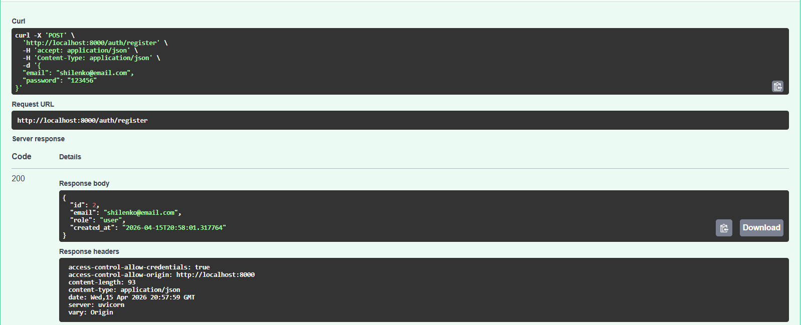

#### Логин и получение токена (POST /auth/login)
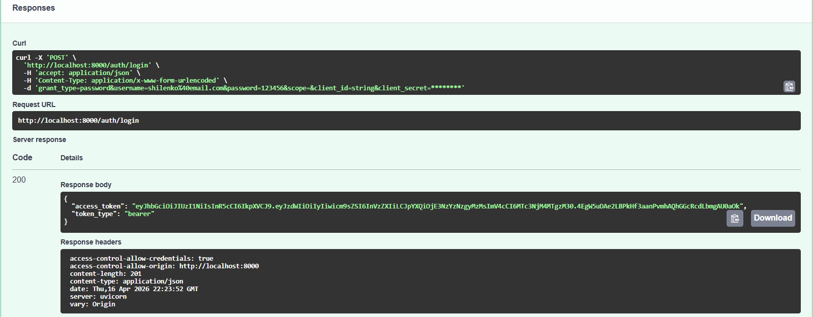

#### Авторизация в Swagger
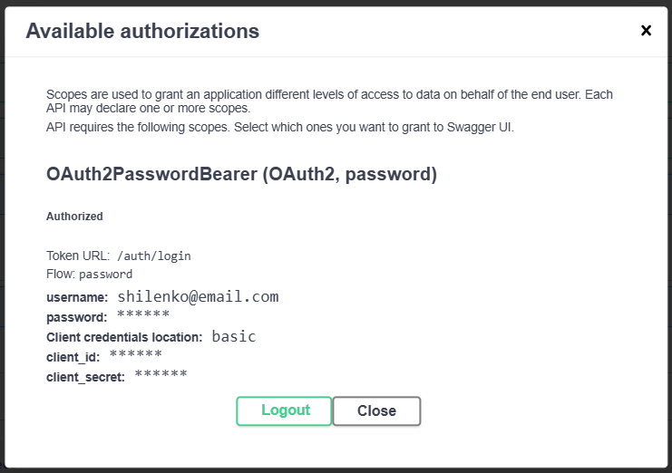

#### Проверка профиля текущего пользователя (GET /auth/me)
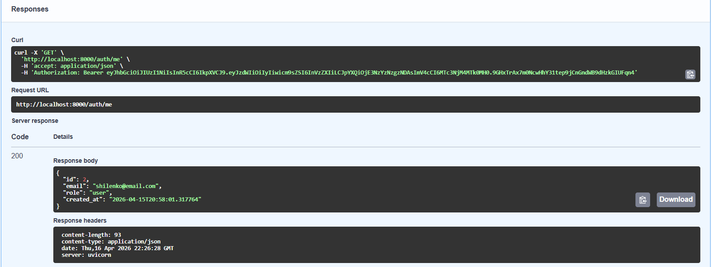

#### Telegram бот: сохранение токена (/token) и ответ от LLM
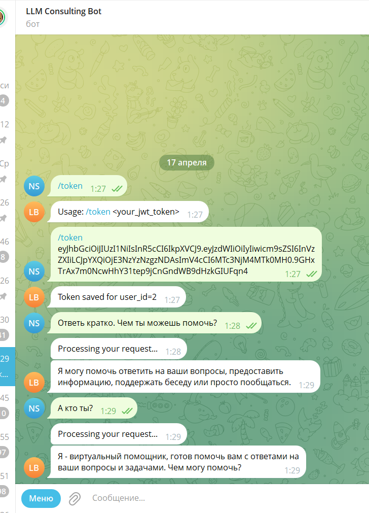

#### RabbitMQ: очередь Celery, активные consumers, логи
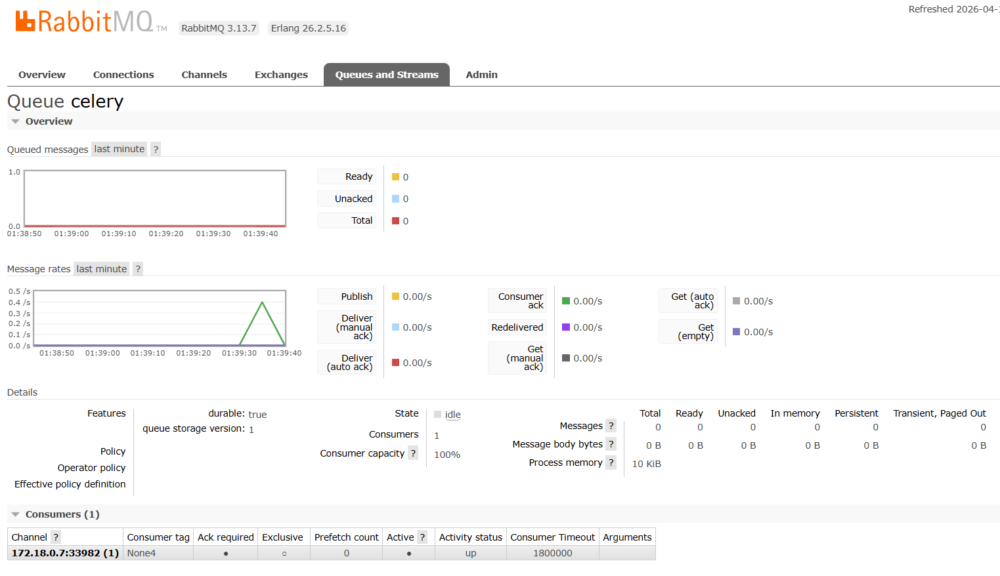
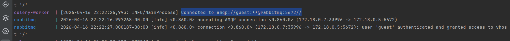
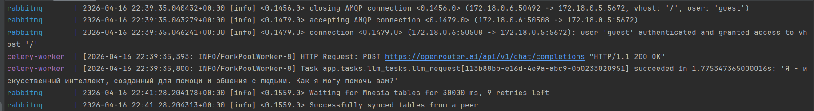

#### Redis: сохранённые токены, логи
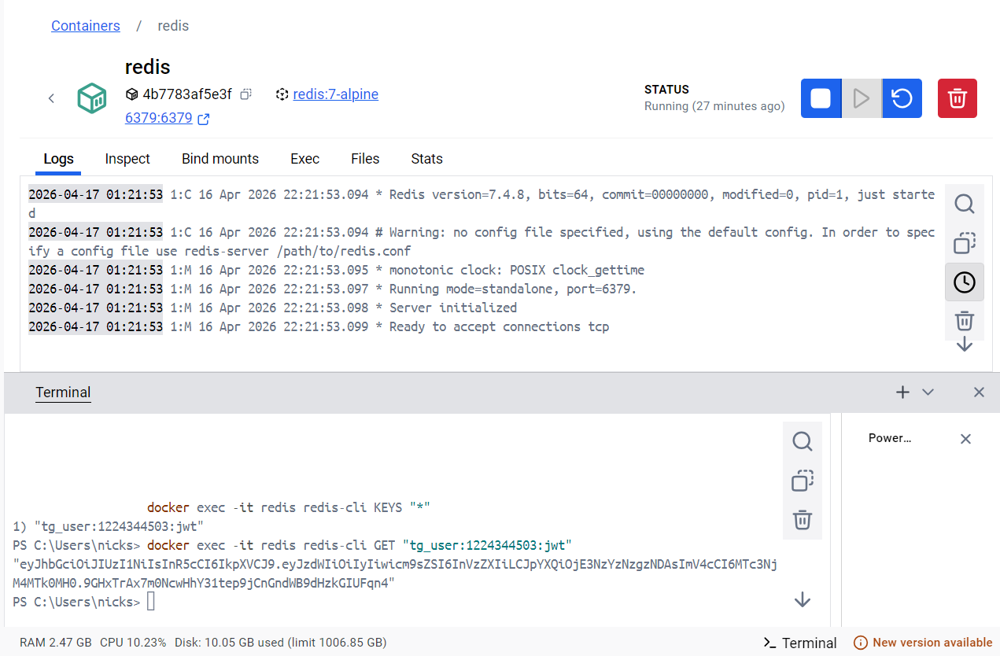

#### Тесты Auth Service
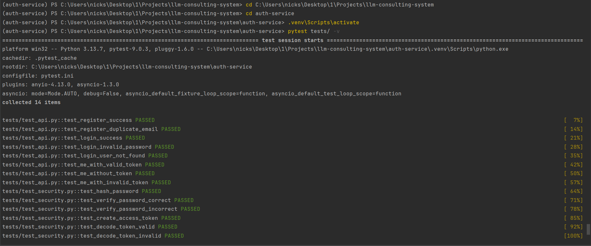

#### Тесты Bot Service
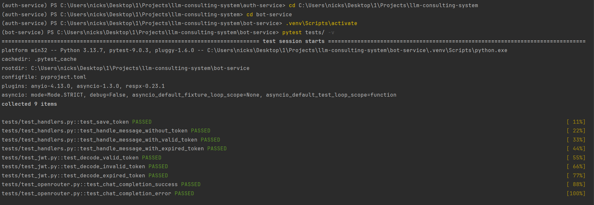

### Health check (GET /health)
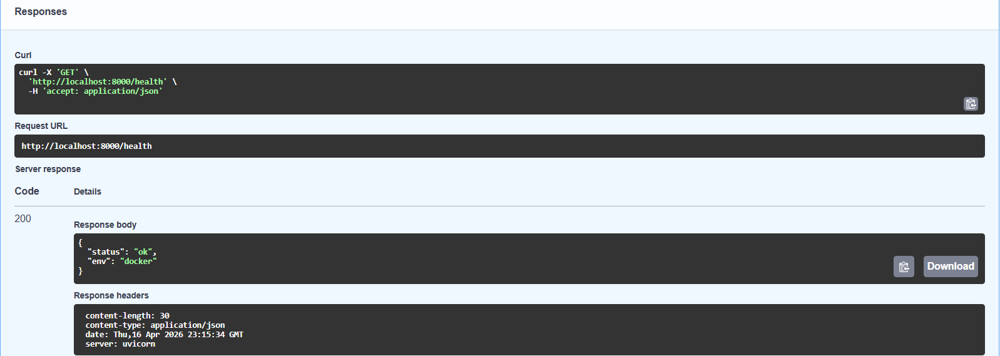
